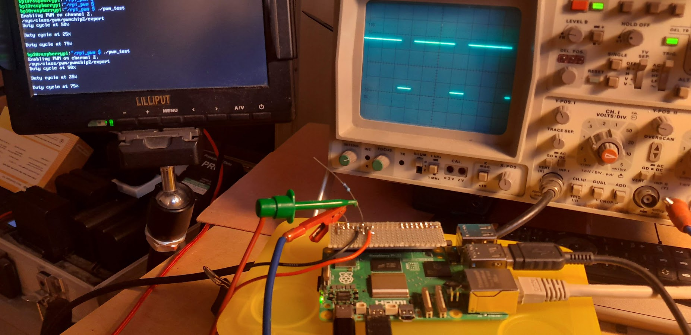

# Raspberry PI 5 PWM C++ class

This is a simple wrapper around the new PWM sysfs on the Raspberry PI running Debian bookworm.
It has been tested on the Raspberry PI 5 and the documentation below is for it.

## Setup

Add to `/boot/firmware/config.txt`:

```
dtoverlay=pwm-2chan
```

and reboot.

Check with:

```
pinctrl -p
```

that you see:

```
12: a3    pd | lo // GPIO18 = PWM0_CHAN2
35: a3    pd | lo // GPIO19 = PWM0_CHAN3
```

which corresponds to the sysfs files:

```
/sys/class/pwm/pwmchip2/pwm2: GPIO18 
/sys/class/pwm/pwmchip2/pwm3: GPIO19
```

## Compilation

```
cmake .
make
```

## Usage

Include `rpi_pwm.h` in your program. The library is header-only.

Create an instance of the class `RPI_PWM`:
```
RPI_PWM pwm;
```
and start the PWM:
```
pwm.start(channel, frequency);
```
where `channel` is either 2 (GPIO18) or 3 (GPIO19) at 0% duty-cycle as a default.

To set the duty-cycle just call `setDutyCycle`:

```
pwm.setDutyCycle(duty_cycle);
```
where `duty_cycle` is a value between 0 and 100.


## Example program



```
./pwm_test <channel>
```

where channel can be either 2 (GPIO18) or 3 (GPIO19). Default is 2.

It starts with a duty-cycle of 50%. If you press a key it changes it to 25%
and then after another key press to 75%. Then it exists after
a final key press.

## Copyright

Bernd Porr, bernd.porr@glasgow.ac.uk
